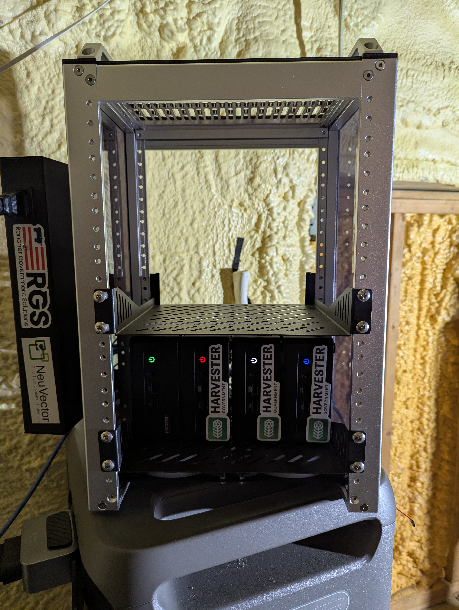
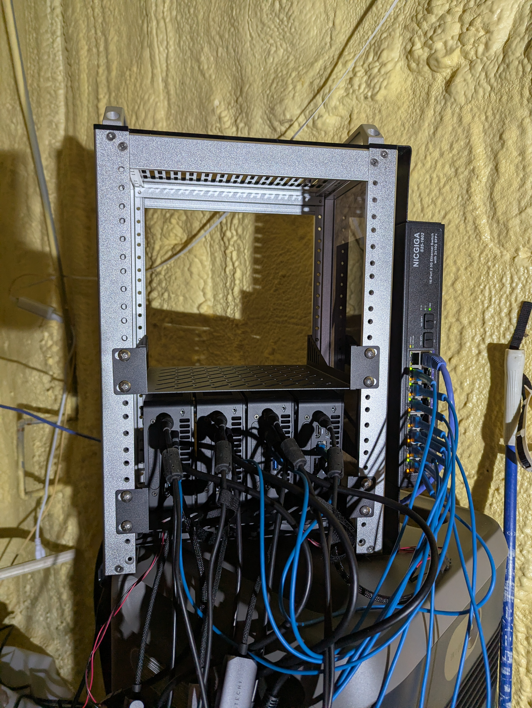

# carbide-enclave.kubernerdes.com

Infrastructure repo for an end-to-end **airgapped** deployment of the RGS Carbide suite —
Harvester, RKE2, Rancher Manager, Harbor, and Keycloak — running in an isolated enclave network
with an NVIDIA DGX Spark for AI workload serving. Everything operates with zero internet access
on the far side of the airgap boundary.

**Full documentation:** [docs.carbide-enclave.kubernerdes.com](https://docs.carbide-enclave.kubernerdes.com)

---

## Hardware

| Host | Role | Model | RAM |
|---|---|---|---|
| nuc-00 | Bastion / airgap boundary | NUC10i7FNK | 64 GB |
| nuc-01 | Harvester node 1 | NUC10i7FNH | 64 GB |
| nuc-02 | Harvester node 2 | NUC10i7FNH | 64 GB |
| nuc-03 | Harvester node 3 | NUC10i7FNH | 64 GB |
| spark | NVIDIA DGX Spark (arm64) | GB10 | 128 GB |
| nas | NAS / NFS | ASUS X99 | 94 GB |

| | |
|---|---|
|  |  |

---

## Stack

| Component | Role |
|---|---|
| Harvester | Bare-metal hypervisor / HCI |
| RKE2 | Kubernetes management cluster |
| Rancher Manager | Cluster lifecycle + RBAC |
| Harbor | OCI container registry |
| Keycloak | OIDC identity provider |
| cert-manager + step-ca | Internal PKI / TLS |
| Hauler | Airgap artifact transport |
| NVIDIA GPU Operator + vLLM | AI inference on DGX Spark |

---

## Repository structure

```
scripts/
  env.d/
    carbide-enclave.sh    # All non-secret env vars — sourced by every script
    creds.example         # Template for ~/.config/RGS/creds (never commit real creds)
  bashrc.d/
    RGS                   # Operator shell environment
  bootstrap-nuc-00.sh     # Bastion host setup (idempotent)
  bootstrap-step-ca.sh    # Internal CA setup on nuc-00 (idempotent)
  bootstrap-rke2.sh       # RKE2 cluster bootstrap
  hauler.sh               # Hauler artifact lifecycle: sync / save / load / serve / push

infra/
  nuc-00/                 # Config backups from nuc-00, mirroring its filesystem paths
  harvester/              # Harvester LB manifests
  tofu/                   # OpenTofu — Harvester VM provisioning
  packer/                 # Packer — SL-Micro VM image builds

platform/
  rke2/                   # RKE2 server/agent configs
  rancher/                # Rancher Helm values
  cert-manager/           # ClusterIssuer / StepIssuer manifests
  step-ca/                # step-ca configs

services/
  harbor/                 # Harbor Helm values + airgap seeding
  keycloak/               # Helm values + realm export
  gpu-operator/           # NVIDIA GPU Operator
  ai-serving/             # vLLM / Ollama + model delivery

docs/                     # Inline reference; full docs in the Docusaurus repo
Images/                   # Hardware photos
```

---

## Getting started

### 1. Credentials

Copy the credentials template and fill in your values:

```bash
mkdir -p ~/.config/RGS
cp scripts/env.d/creds.example ~/.config/RGS/creds
chmod 600 ~/.config/RGS/creds
# edit ~/.config/RGS/creds — never commit this file
```

All non-secret environment variables live in `scripts/env.d/carbide-enclave.sh` and are
committed. Secrets (registry passwords, CA password, RKE2 token) live only in `~/.config/RGS/creds`.

### 2. Operator shell (optional)

Source the operator environment for a convenient shell session on nuc-00:

```bash
source scripts/bashrc.d/RGS
```

### 3. Bootstrap sequence

```
1.  Bastion (nuc-00)          sudo bash scripts/bootstrap-nuc-00.sh
2.  Internal CA (step-ca)     sudo bash scripts/bootstrap-step-ca.sh
3.  Hauler collect            bash scripts/hauler.sh sync
4.  Hauler save               bash scripts/hauler.sh save
    ── airgap boundary ────────────────────────────────────────────────────
5.  Hauler load               sudo bash scripts/hauler.sh load <tarball>
6.  Hauler serve              sudo bash scripts/hauler.sh serve
7.  Harvester install         iPXE boot nuc-01/02/03 from nuc-00
                              (configs at http://10.0.0.10/harvester/)
8.  Harvester post-install    KUBECONFIG=~/.kube/carbide-enclave-harvester.kubeconfig \
                              bash scripts/bootstrap-harvester.sh
                              (namespaces + CA cert + LoadBalancers)
9.  Provision RKE2 VMs        cd infra/tofu/rke2-cluster && tofu apply
10. RKE2 cluster              bash scripts/bootstrap-rke2.sh
11. cert-manager + StepIssuer → platform/cert-manager/
12. Harbor                    → services/harbor/
13. Hauler → Harbor migration bash scripts/hauler.sh push
14. Keycloak                  → services/keycloak/
15. Rancher Manager           → platform/rancher/
16. DGX Spark join            → services/gpu-operator/
17. AI serving                → services/ai-serving/
```

Steps 1–4 require internet access. Steps 5–17 are fully airgapped.

---

## Key design decisions

| Decision | Choice |
|---|---|
| Airgap transport | Hauler — OCI + Helm + files in one store |
| Container registry | Harbor — full OCI, OIDC auth, Helm proxy |
| Internal CA | step-ca — ACME + cert-manager StepIssuer |
| OIDC provider | Keycloak |
| Hypervisor | Harvester HCI |
| Guest OS | SL-Micro 6.2 (immutable, transactional) |
| IaC | OpenTofu with Harvester provider |
| AI serving | vLLM (primary), Ollama (fallback) |
| arm64 | DGX Spark — all artifacts include linux/arm64 |

---

## Related repositories

| Repo | Purpose |
|---|---|
| [docs.carbide-enclave.kubernerdes.com](https://github.com/jradtke-rgs/docs.carbide-enclave.kubernerdes.com) | Docusaurus documentation site |
| [homelab.kubernerdes.com](https://github.com/jradtke-rgs/homelab.kubernerdes.com) | Hardware inventory |
